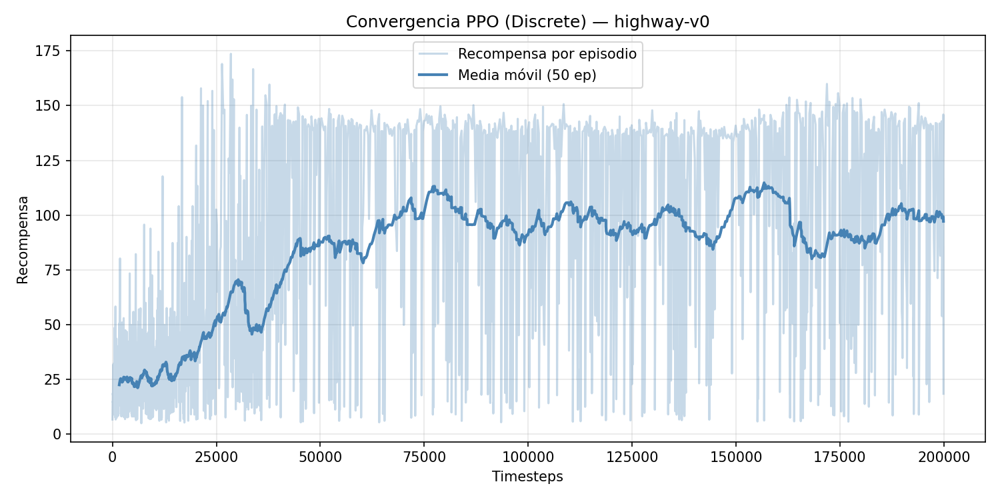
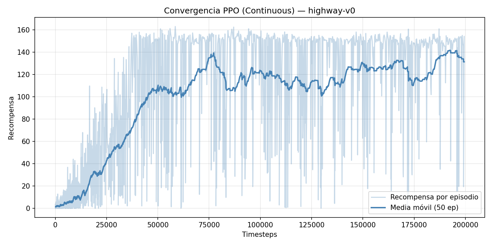
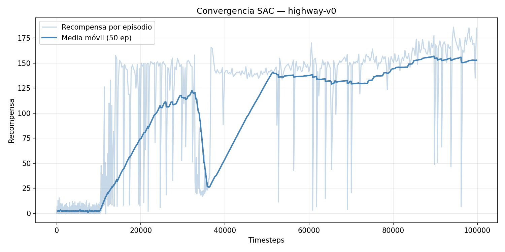

# Trabajo final: aprendizaje por refuerzo en `highway-v0`

Alumno: Kevin André Cajachuán Arroyo  
Repositorio: [https://github.com/Kajachuan/ar2](https://github.com/Kajachuan/ar2)

## Introducción

En este trabajo se entrenaron y compararon tres agentes de aprendizaje por refuerzo sobre el entorno `highway-v0` de `highway-env`. El objetivo del agente es conducir un vehículo en una autopista con tráfico, maximizando la recompensa asociada a circular a buena velocidad y evitando colisiones o salidas de la calzada.

Se evaluaron tres variantes:

- PPO con acciones discretas.
- PPO con acciones continuas.
- SAC con acciones continuas.

En todos los casos se usó una observación de tipo `Kinematics`, con información normalizada de hasta 15 vehículos cercanos. Las características consideradas fueron presencia, posición relativa (`x`, `y`) y velocidades (`vx`, `vy`). El entorno se configuró con 4 carriles, 50 vehículos, densidad de tráfico 1.2 y episodios de hasta 60 segundos.

La recompensa utilizada penaliza las colisiones (`collision_reward = -2.0`) y los cambios de carril (`lane_change_reward = -0.05`), mientras que premia circular a alta velocidad (`high_speed_reward = 2.5`) dentro del rango de velocidad objetivo `[20, 30]`. Además, se usó recompensa normalizada y la salida de la ruta como condición terminal.

## PPO con acciones discretas

En el primer experimento se entrenó PPO usando el espacio de acciones `DiscreteMetaAction`. Esto significa que el agente no controla directamente aceleración y dirección como valores continuos, sino que elige entre acciones de alto nivel definidas por el entorno, por ejemplo acelerar, desacelerar o cambiar de carril.

El modelo se entrenó durante `200000` timesteps usando 8 entornos paralelos. La política fue una red `MlpPolicy` con arquitectura `[256, 256]`, `learning_rate = 3e-4`, `gamma = 0.99`, `n_steps = 256`, `batch_size = 256`, `clip_range = 0.2` y `ent_coef = 0.05`.

La curva muestra una mejora clara durante el entrenamiento. Al comienzo, la media móvil de recompensa se encuentra alrededor de valores bajos, cercanos a 20-25, lo que indica una política todavía poco efectiva. A medida que avanza el entrenamiento, la media móvil sube y se estabiliza aproximadamente entre 90 y 110 puntos, aunque con bastante variabilidad entre episodios.

En los logs se registraron 1450 episodios. La recompensa promedio global fue de aproximadamente 68.74, con un máximo de 173.63. Si se comparan los primeros 20 episodios con los últimos 20, la recompensa media pasa de 22.67 a 101.84. Esto evidencia que el agente aprendió una estrategia mucho mejor que la inicial.

El video generado para este agente se encuentra en: [Video PPO discreto](https://github.com/Kajachuan/ar2/blob/main/highway-v0-PPO-D/videos/rl-video-episode-0.mp4)

En el video se observa que el vehículo controlado logra mantenerse durante todo el episodio sin colisionar. Su comportamiento es bastante conservador: permanece principalmente en el carril superior y no realiza maniobras bruscas ni cambios de carril frecuentes. Esto es coherente con el uso de acciones discretas, ya que el agente elige entre acciones de alto nivel y no puede ajustar la dirección o la aceleración con tanta fineza. El resultado es una política funcional y estable, aunque menos flexible para aprovechar huecos en el tráfico o mejorar aún más la velocidad promedio.

## PPO con acciones continuas

En el segundo experimento se mantuvo el algoritmo PPO, pero se cambió el espacio de acciones a `ContinuousAction`. En este caso el agente controla la conducción mediante valores continuos, lo que permite maniobras más finas y una respuesta más gradual frente al tráfico.

La configuración general del entorno fue la misma que en PPO discreto. También se entrenó durante `200000` timesteps con 8 entornos paralelos, usando `MlpPolicy`, arquitectura `[256, 256]`, `learning_rate = 3e-4`, `gamma = 0.99`, `n_steps = 256`, `batch_size = 256`, `clip_range = 0.2` y `ent_coef = 0.05`.

La curva de PPO continuo muestra un aprendizaje más marcado que la versión discreta. Al inicio las recompensas son muy bajas, pero la media móvil aumenta rápidamente hasta superar los 100 puntos alrededor de la primera mitad del entrenamiento. Luego se mantiene en una zona alta, generalmente entre 110 y 135, con picos cercanos a 140.

En los logs se registraron 2478 episodios. La recompensa promedio global fue de aproximadamente 40.22, aunque este valor queda afectado por la gran cantidad de episodios iniciales de bajo rendimiento. La comparación entre los primeros y los últimos 20 episodios es más representativa: la media pasa de 2.10 a 119.99. El máximo registrado fue de 163.16.

El video generado para este agente se encuentra en: [Video PPO continuo](https://github.com/Kajachuan/ar2/blob/main/highway-v0-PPO-C/videos/rl-video-episode-0.mp4)

En el video se ve un comportamiento más activo que en PPO discreto. El vehículo controlado realiza maniobras continuas, con cambios de orientación progresivos y desplazamientos entre carriles para adaptarse al tráfico. No se observan choques en el episodio grabado, y la trayectoria muestra que el agente aprovecha mejor el espacio disponible que la versión discreta. Esto acompaña lo que se ve en la curva de recompensas: al disponer de acciones continuas, PPO puede aprender una conducción más suave y con mayor capacidad de ajuste.

## SAC con acciones continuas

El tercer experimento utilizó SAC, también con `ContinuousAction`. SAC es un algoritmo off-policy basado en actor-critic que incorpora una componente de entropía en el objetivo. Esto favorece la exploración y busca políticas robustas, especialmente en espacios de acción continuos.

El entrenamiento se realizó durante `100000` timesteps. A diferencia de PPO, se usó un único entorno con `Monitor`. Los principales hiperparámetros fueron `learning_rate = 3e-4`, `buffer_size = 100000`, `learning_starts = 10000`, `batch_size = 256`, `gamma = 0.99`, `tau = 0.005`, `train_freq = 1`, `gradient_steps = 1` y `ent_coef = "auto"`.

La curva de SAC muestra un comportamiento distinto al de PPO. Durante los primeros timesteps la recompensa se mantiene casi nula, lo cual es esperable porque el algoritmo acumula experiencia y comienza a aprender luego de `learning_starts = 10000`. Después aparece una mejora pronunciada, con una subida fuerte de la media móvil. También se observa una caída intermedia alrededor de los 35000 timesteps, seguida por una recuperación. Hacia el final, la media móvil se estabiliza en los valores más altos de los tres experimentos, alrededor de 150 puntos.

En los logs se registraron 2520 episodios. La recompensa promedio global fue de aproximadamente 19.79, nuevamente influida por muchos episodios iniciales de bajo rendimiento. La media de los primeros 20 episodios fue 2.03, mientras que en los últimos 20 subió a 154.71. El máximo registrado fue de 185.88, el mayor de los tres enfoques.

El video generado para este agente se encuentra en: [Video SAC](https://github.com/Kajachuan/ar2/blob/main/highway-v0-SAC/videos/rl-video-episode-0.mp4)

En el video de SAC el vehículo controlado también completa el episodio sin colisiones visibles. A diferencia de PPO continuo, la conducción parece más estable y menos oscilante: el agente mantiene una trayectoria ordenada durante gran parte del recorrido y realiza ajustes puntuales cuando el tráfico lo requiere. Esto coincide con el mejor valor final de recompensa observado en los logs. Aunque durante el entrenamiento SAC tuvo una etapa inicial más lenta y una caída intermedia en la media móvil, la política final muestra una conducción efectiva en el episodio grabado.

## Comparación general

| Experimento | Acciones | Timesteps | Episodios registrados | Media primeros 20 | Media últimos 20 | Máximo |
| --- | --- | ---: | ---: | ---: | ---: | ---: |
| PPO discreto | Discretas | 200000 | 1450 | 22.67 | 101.84 | 173.63 |
| PPO continuo | Continuas | 200000 | 2478 | 2.10 | 119.99 | 163.16 |
| SAC | Continuas | 100000 | 2520 | 2.03 | 154.71 | 185.88 |

Los tres agentes muestran aprendizaje, pero con diferencias claras. PPO con acciones discretas logra una mejora importante y aprende una política funcional, aunque queda limitado por la granularidad de las acciones disponibles. PPO con acciones continuas mejora ese resultado al permitir maniobras más finas, alcanzando mejores recompensas finales y una conducción más suave. SAC obtiene el mejor rendimiento final: aunque su curva es menos regular y presenta una etapa inicial más lenta, termina con la media de recompensa más alta y el mayor máximo registrado.

En conclusión, para este entorno de conducción, las acciones continuas resultan más adecuadas que las discretas porque permiten controlar el vehículo con mayor precisión. Entre los algoritmos evaluados, SAC fue el que alcanzó el mejor resultado final, mientras que PPO continuo ofreció una alternativa competitiva y más estable visualmente durante buena parte del entrenamiento.
